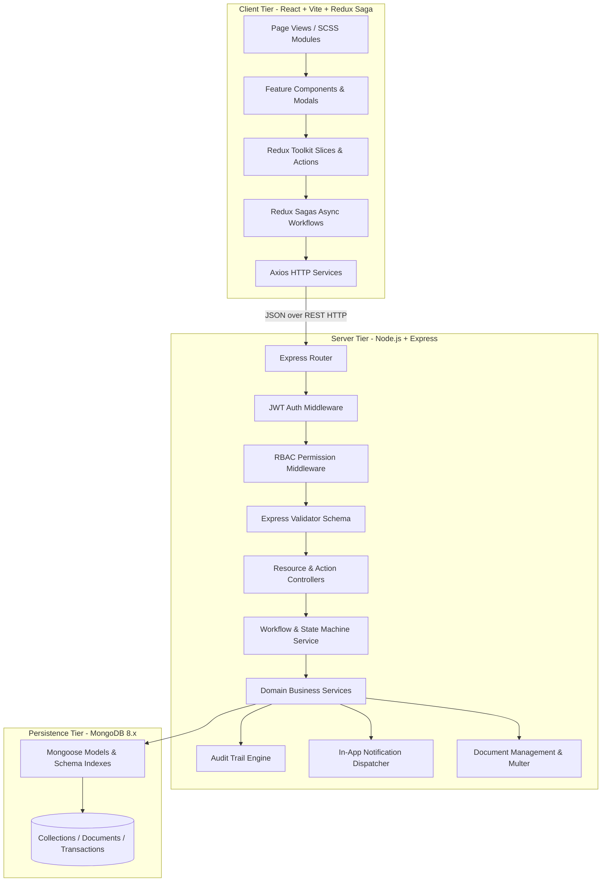
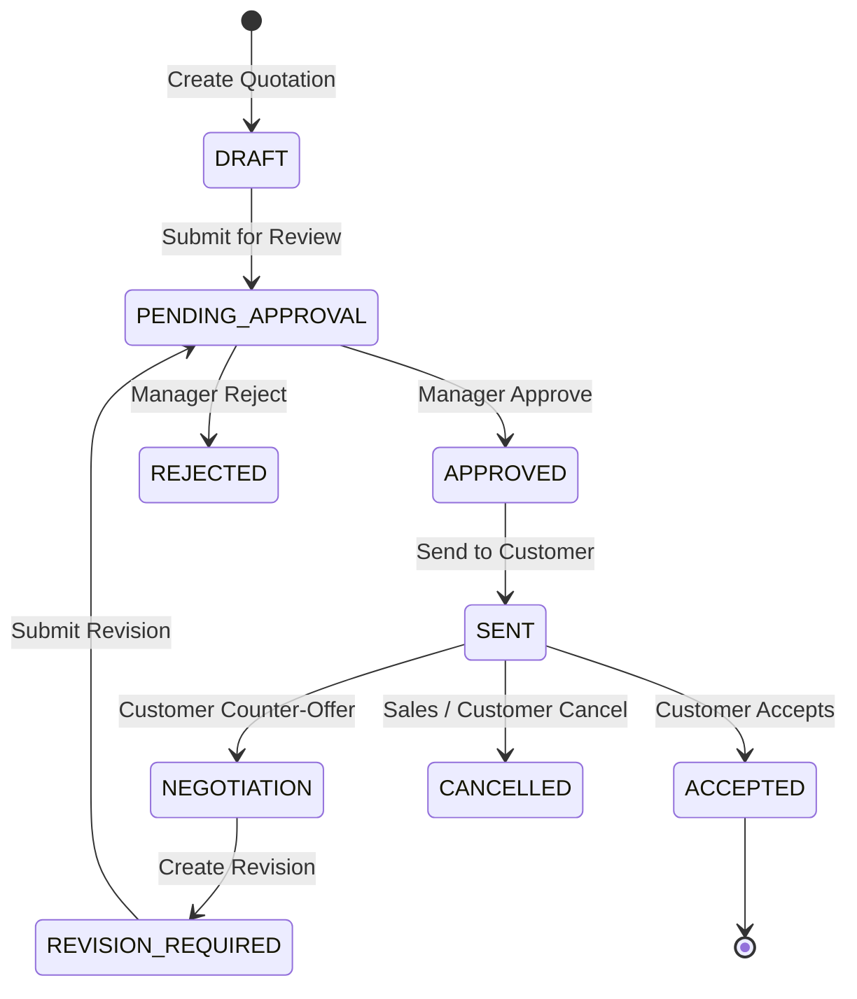
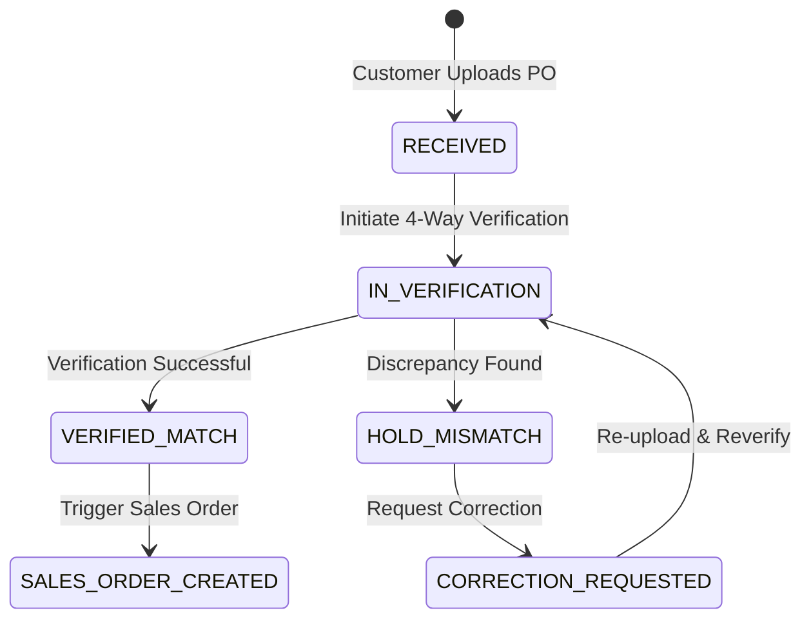
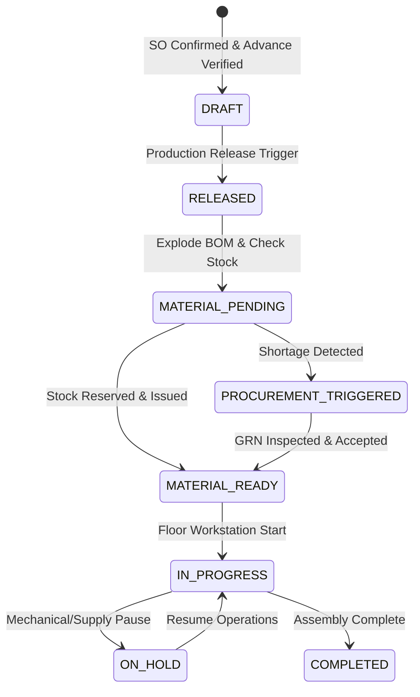
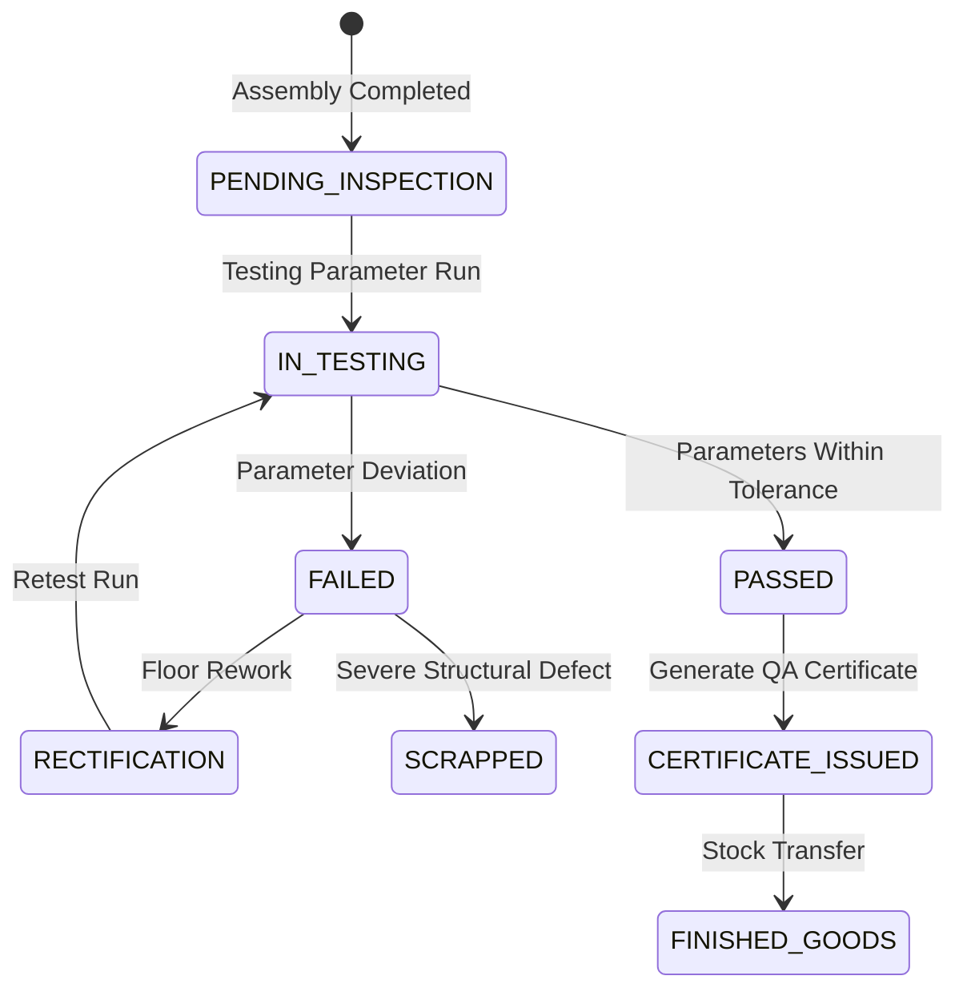
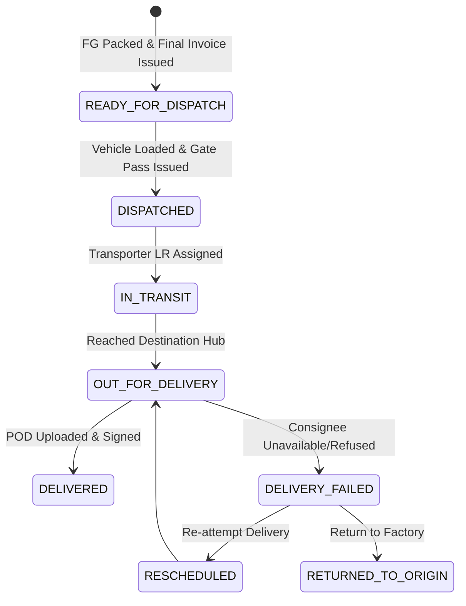
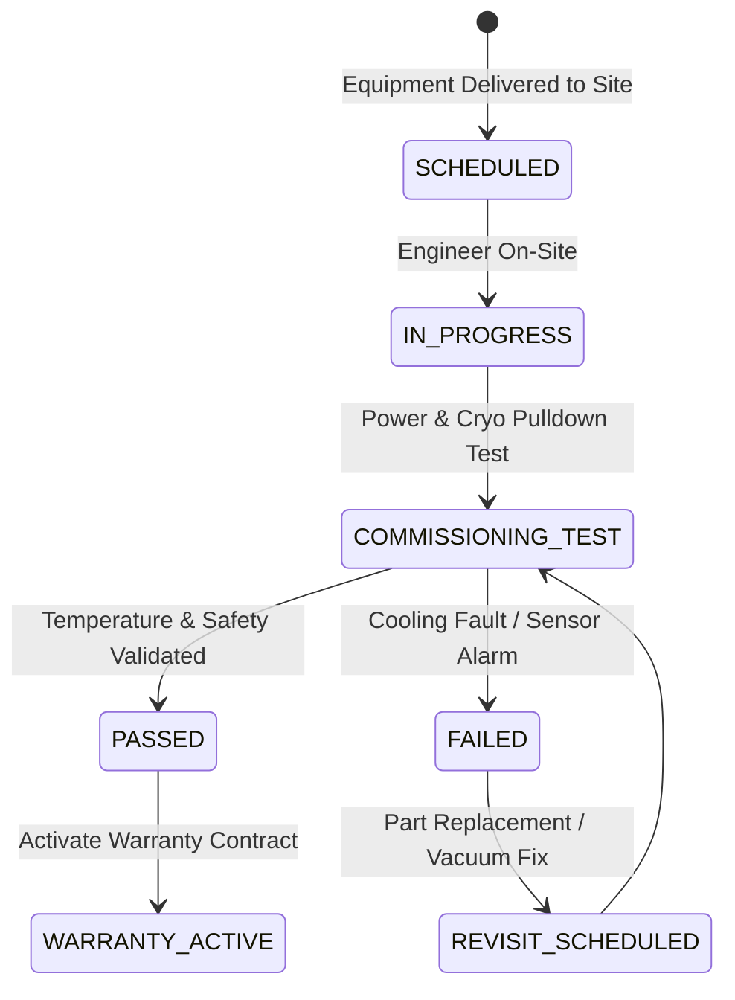
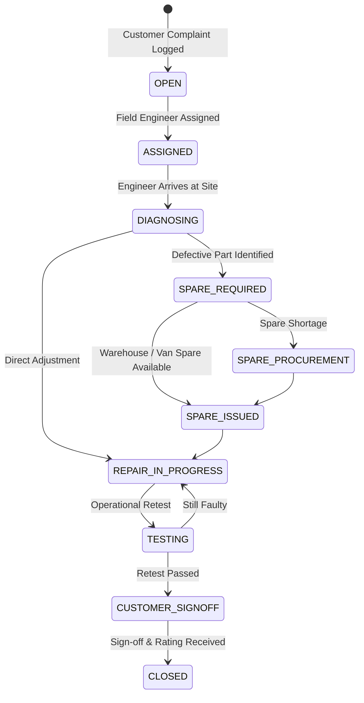

# CryoTech Industrial ERP - Implementation Plan

## 1. Project Objective & Scope

### 1.1 Objective
The **CryoTech Industrial ERP** is a mission-critical, enterprise-grade, workflow-driven Enterprise Resource Planning (ERP) web application specifically engineered for high-precision manufacturing, cryogenic equipment assembly, industrial sales, quality compliance, logistics, installation commissioning, and post-sale field service operations.

The system enforces a connected, end-to-end, multi-stage business workflow where every phase (Lead $\to$ Quotation $\to$ Negotiation $\to$ Revision $\to$ Acceptance $\to$ Proforma Invoice $\to$ Customer PO $\to$ PO Verification $\to$ Sales Order $\to$ Payment $\to$ Production Order $\to$ BOM $\to$ Material Request $\to$ Inventory Check $\to$ Procurement RFQ/PO $\to$ GRN $\to$ Production Operations $\to$ WIP/Consumption $\to$ QA & Retest/Rework $\to$ Serial Traceability $\to$ Finished Goods $\to$ Packing $\to$ Final Invoice $\to$ Dispatch $\to$ Delivery/POD $\to$ Installation $\to$ Commissioning $\to$ Warranty $\to$ Field Service $\to$ RMA/Replacement) is strictly governed by authoritative backend state machines, role-based access controls (RBAC), immutable audit logging, document versioning, and real-time notifications.

### 1.2 Core Tenets
1. **Authoritative Backend**: No business rules, status transitions, or validation checks exist solely in frontend code.
2. **State-Machine Driven**: Entities transition strictly via defined actions (`POST /api/:resource/:id/actions/:action`) validated against preconditions, permissions, and required inputs.
3. **No Dead-End Workflows & No Fake Buttons**: Every action button on the UI maps to an active backend route, service handler, state transition, and audit trail record.
4. **Traceability**: Comprehensive 360-degree serial number history tracing components from raw material GRN up to post-warranty RMA.
5. **Double-Entry Inventory Ledger**: Stock quantities are derived from an immutable inventory movement ledger (no unverified ad-hoc updates).

---

## 2. High-Level Architecture

### 2.1 Multi-Tier Layered Architecture


### 2.2 Standard Workflow Action Pipeline
When an action is initiated from the client (e.g. `POST /api/quotations/:id/actions/approve`):
1. **Transport**: Axios sends JWT in `Authorization: Bearer <token>`.
2. **Auth & Identity**: `authenticate` middleware verifies JWT, loads user context, attaches `req.user`.
3. **RBAC**: `authorize('quotation.approve')` checks if `req.user.permissions` contains the required permission.
4. **Validation**: `express-validator` checks input payload (e.g. `remarks`).
5. **State Machine Execution**: `workflowService.transition(entityType, entityId, action, payload, user)`:
   - Retrieves active document.
   - Validates that `currentStatus` allows `action`.
   - Evaluates domain preconditions (e.g., minimum line items, pricing checks, required approval authority).
   - Updates target document with `newStatus` and metadata.
6. **Side Effects**:
   - Creates immutable `AuditLog` entry with `previousStatus`, `newStatus`, `actorUserId`, `reason`, `changedFields`.
   - Triggers `Notification` for relevant recipients (e.g. Sales rep informed of Quotation Approval).
7. **Response**: Returns standard payload `{ success: true, message, data }`.
8. **Client Sync**: Redux action receives updated model and synchronizes local slice state without page reload.

---

## 3. Technology Stack

### 3.1 Frontend
- **Runtime & Bundler**: React 18, Vite 5.
- **Language**: JavaScript (ES6+), JSX.
- **Styling**: Vanilla SCSS Modules (`.module.scss`) with modern CSS variables (Design System: slate/navy dark mode & ultra-clean industrial light mode, glassmorphism, responsive tables, badge badges, timeline components).
- **Routing**: React Router v6.
- **State Management**: Redux Toolkit (`@reduxjs/toolkit`) + Redux Saga (`redux-saga`) for side-effects and asynchronous workflow execution.
- **HTTP Client**: Axios with request/response interceptors for JWT injection and centralized 401/403/422 error normalization.
- **Forms & Validation**: React Hook Form (`react-hook-form`).
- **Icons**: Material-UI Icons (`@mui/icons-material`).
- **Testing**: Vitest, React Testing Library.

### 3.2 Backend
- **Runtime & Server**: Node.js v24 LTS, Express.js.
- **Language**: JavaScript (Node CommonJS/ESM hybrid clean structure).
- **Authentication**: JSON Web Tokens (`jsonwebtoken`), password hashing with `bcryptjs`.
- **Validation**: `express-validator` schema-based validation.
- **Database ODM**: Mongoose 8.x.
- **File Uploads**: `multer` with local storage repository `/uploads` (PDF, images, test certificates, POD documents).
- **Security & Utilities**: `helmet`, `cors`, `morgan`, `compression`.
- **Testing**: Jest / Supertest.

### 3.3 Database
- **Engine**: MongoDB Community / Atlas.
- **Indexing**: Compound and unique indexes on business identifiers (`quotationNumber`, `salesOrderNumber`, `serialNumber`, `poNumber`, `batchNumber`), status fields, foreign keys (`customerId`, `productId`, `vendorId`), and date ranges.

---

## 4. Role-Based Access Control (RBAC) Architecture

### 4.1 Roles (12 Seeded Roles)
| Role Code | Role Name | Primary Responsibility |
|---|---|---|
| `ADMIN` | Super Administrator | Full system configuration, user provisioning, role assignments, audit inspection. |
| `MANAGEMENT` | Executive Management | Executive cross-functional dashboards, high-value overrides, financial & margin reports. |
| `SALES` | Sales Representative | Lead capture, qualification, customer onboarding, quotation draft & negotiation. |
| `SALES_MANAGER` | Sales Manager | Quotation approvals, commercial discounts, customer PO review, contract sign-offs. |
| `ACCOUNTS` | Finance & Accounts | Proforma invoices, payment entry & verification, tax invoices, credit notes, refunds. |
| `PURCHASE` | Procurement Officer | Vendor master, RFQs, vendor quote comparison, vendor PO creation & approval. |
| `STORE` | Inventory & Stores Officer | Material stock check, reservation, issue, GRN inspection receipt, warehouse transfers. |
| `PRODUCTION` | Production Manager / Supervisor | Production orders, BOM management, operation progress tracking, WIP reporting. |
| `QA` | Quality Assurance Engineer | Inspection templates, test execution, certificate generation, rework/scrap verdict. |
| `DISPATCH` | Logistics & Dispatch | Finished goods packing list, carrier assignment, gate pass, delivery tracking, POD. |
| `SERVICE_MANAGER` | Customer Service Manager | Service ticket triage, warranty adjudication, service quotations, engineer scheduling. |
| `SERVICE_ENGINEER` | Field Service Engineer | Site diagnosis, on-site repairs, spare part consumption, customer sign-off. |

### 4.2 Permission Matrix Overview
Each role has a curated list of granular permissions formatted as `<module>.<action>`:
- **Lead**: `lead.view`, `lead.create`, `lead.edit`, `lead.qualify`, `lead.lose`
- **Customer**: `customer.view`, `customer.create`, `customer.edit`
- **Quotation**: `quotation.view`, `quotation.create`, `quotation.edit`, `quotation.submit`, `quotation.approve`, `quotation.reject`, `quotation.send`, `quotation.cancel`
- **Revision**: `quotationRevision.create`, `quotationRevision.approve`, `quotationRevision.send`
- **PO Verification**: `customerPo.view`, `customerPo.create`, `customerPo.verify`, `customerPo.hold`
- **Sales Order**: `salesOrder.view`, `salesOrder.create`, `salesOrder.confirm`, `salesOrder.cancel`
- **Payment**: `payment.view`, `payment.create`, `payment.verify`, `payment.reverse`, `payment.refund`
- **Production**: `production.view`, `production.create`, `production.release`, `production.start`, `production.hold`, `production.complete`
- **BOM**: `bom.view`, `bom.create`, `bom.edit`
- **Inventory**: `inventory.view`, `inventory.reserve`, `inventory.issue`, `inventory.return`, `inventory.transfer`, `inventory.adjust`
- **Procurement**: `procurement.view`, `procurement.rfq`, `procurement.compare`, `vendorPo.create`, `vendorPo.approve`, `grn.create`, `grn.inspect`
- **QA**: `qa.view`, `qa.test`, `qa.pass`, `qa.fail`, `qa.retest`, `qa.rework`, `qa.scrap`
- **Serial Traceability**: `serial.view`, `serial.create`, `serial.track`
- **Logistics**: `dispatch.view`, `dispatch.create`, `dispatch.dispatch`, `delivery.view`, `delivery.complete`, `delivery.fail`, `delivery.reschedule`
- **Service & Warranty**: `installation.view`, `installation.update`, `commissioning.view`, `commissioning.test`, `warranty.view`, `service.view`, `service.create`, `service.assign`, `service.diagnose`, `service.repair`, `service.test`, `service.close`
- **Audit & Documents**: `audit.view`, `documents.view`, `documents.upload`, `reports.view`, `reports.export`

### 4.3 Demo User Credentials (Local / Dev)
All accounts use the universal development password: `Password@123`
1. `admin@example.com` (`ADMIN`)
2. `management@example.com` (`MANAGEMENT`)
3. `sales@example.com` (`SALES`)
4. `manager@example.com` (`SALES_MANAGER`)
5. `accounts@example.com` (`ACCOUNTS`)
6. `purchase@example.com` (`PURCHASE`)
7. `store@example.com` (`STORE`)
8. `production@example.com` (`PRODUCTION`)
9. `qa@example.com` (`QA`)
10. `dispatch@example.com` (`DISPATCH`)
11. `service@example.com` (`SERVICE_MANAGER`)
12. `engineer@example.com` (`SERVICE_ENGINEER`)

---

## 5. End-to-End Workflow & Module Architecture

### 5.1 Complete Workflow Diagram

```mermaid
flowchart TD
    L1[02 Lead / Enquiry] -->|Qualify| C1[03 Customer Master]
    C1 --> Q1[04 Quotation Draft]
    Q1 -->|Submit| Q2[Pending Approval]
    Q2 -->|Approve| Q3[Approved Quotation]
    Q3 -->|Send| Q4[Sent to Customer]

    Q4 -->|Customer Counter-Offer| N1[05 Negotiation]
    N1 -->|Revise| R1[06 Quotation Revision]
    R1 -->|Approve & Send| Q4

    Q4 -->|Customer Accepts| A1[07 Acceptance]
    A1 --> PI[08 Proforma Invoice]
    PI --> CPO[09 Customer PO Received]
    CPO --> POV{10 PO Verification}

    POV -->|Mismatch| POH[PO Hold / Correction / Reverify]
    POH --> POV
    POV -->|Match| SO[11 Sales Order Confirmed]

    SO --> PAY[12 Payment Received & Verified]
    PAY --> PR[Production Release Trigger]

    PR --> PRO[13 Production Order]
    PRO --> BOM[14 Bill of Materials]
    BOM --> MR[15 Material Request]
    MR --> IC{16 Inventory Check}

    IC -->|Stock Available| RES[Reserve & Issue to Floor]
    IC -->|Stock Deficit| PROC[17 Procurement RFQ / Quotes / Selection]
    PROC --> VPO[18 Vendor PO]
    VPO --> GRN[19 Goods Receipt Note]
    GRN --> RES

    RES --> POP[20 Production Operations: Fab / Refrig / Elec / Assembly]
    POP --> MC[21 Material Consumption & 22 WIP]
    MC --> QA{23 QA Testing}

    QA -->|Fail| QAF[Rectification / Retest]
    QAF -->|Unrecoverable| QAR[Rework or Scrap]
    QAF -->|Fixed| QA
    QA -->|Pass| QAC[QA Certificate & 24 Serial Traceability]

    QAC --> FG[25 Finished Goods]
    FG --> PK[26 Packing & Box Labeling]
    PK --> INV[27 Final Tax Invoice & 28 Accounts Ledger]
    INV --> DIS[29 Dispatch Order & LR Document]
    DIS --> DEL{30 Delivery / In-Transit}

    DEL -->|Fail| DELF[Reschedule or Return]
    DEL -->|Delivered| POD[Proof of Delivery Uploaded]

    POD --> INST[31 Installation on Site]
    INST --> COMM{32 Commissioning Checklist}
    COMM -->|Fail| COMF[Revisit & Rectify]
    COMF --> COMM
    COMM -->|Pass| WAR[33 Warranty Activated]

    WAR -.->|Ticket Raised| ST[34 Service Ticket]
    ST --> WCHK{35 Warranty Check}
    WCHK -->|Valid| FSRV[Free Warranty Service]
    WCHK -->|Expired / Excluded| SQ[36 Service Quotation & Customer Approval]
    FSRV --> ASG[37 Assign Engineer]
    SQ --> ASG
    ASG --> DIAG[38 Site Diagnosis]
    DIAG --> SPCHK{39 Spare Parts Required?}
    SPCHK -->|Yes: Available| SPISS[Issue Spare]
    SPCHK -->|Yes: Out of Stock| SPPROC[Procure Spare & Issue]
    SPCHK -->|No| REP[40 On-Site Repair / 41 Factory Return]
    SPISS --> REP
    SPPROC --> REP
    REP --> STEST{42 Service Retest & Sign-Off}
    STEST -->|Pass| SCLS[Service Ticket Closed]
    STEST -->|Fail| REP
```


### 5.2 42 Functional Workflow Modules + Masters + Controls + Exceptions
Each module has a dedicated Page, Model, Controller, Service, Validator, and Status Machine:

#### A. Masters (Reference Data)
1. **Customer Master**: Company, GSTIN, contacts, credit limits, billing & shipping addresses.
2. **Product Master**: SKU, model name, cooling capacity, cryogenic rating, electrical specs, base price, standard warranty months.
3. **Vendor Master**: Supplier ratings, GSTIN, bank details, contact persons, payment terms.
4. **Employee / User Master**: Name, email, phone, role, department, status.
5. **Warehouse Master**: Raw Material Store, Assembly Floor, Finished Goods Yard, Quarantine Bay.
6. **Work Center Master**: Fabrication Shop, Refrigeration Bay, Electrical Wiring Bay, Final Assembly, Testing Bay.
7. **Terms Masters**: Tax Rules (GST/VAT), Payment Terms (30% adv / 70% against PI), Delivery Terms (Ex-Works / CIF / FOB), Warranty Terms (12m comprehensive, 36m compressor).

#### B. Sales Cycle (01 - 12)
1. **01 Dashboard**: Executive KPI metrics, conversion funnel, revenue run-rate, pending approvals.
2. **02 Lead / Enquiry**: Source, requirement specs, estimated budget, status (`NEW`, `CONTACTED`, `FOLLOW_UP`, `QUALIFIED`, `LOST`).
3. **03 Customer**: Generated from qualified lead or created directly; status (`ACTIVE`, `INACTIVE`, `BLOCKED`).
4. **04 Quotation**: Multi-line item commercial proposal, discount, taxes, delivery lead time (`DRAFT`, `PENDING_APPROVAL`, `APPROVED`, `REJECTED`, `SENT`, `ACCEPTED`, `NEGOTIATION`, `REVISION_REQUIRED`, `EXPIRED`, `CANCELLED`).
5. **05 Negotiation**: Counter-offer log, requested price, technical deviations, manager review comments.
6. **06 Quotation Revision**: Dedicated version control (`QT-0012-R1`, `QT-0012-R2`), diff visualization, reason for change, approval gate.
7. **07 Acceptance**: Customer acceptance confirmation, approval letter attachment, trigger for Proforma Invoice.
8. **08 Proforma Invoice**: Advance commercial invoice (`PI-XXXX`), bank details, required advance percentage (`DRAFT`, `ISSUED`, `PAID`, `CANCELLED`).
9. **09 Customer PO**: Customer's official Purchase Order document recording (`PO-XXXX`), total value, requested delivery date, payment terms.
10. **10 PO Verification**: 4-Way Comparison Engine: Quotation vs Accepted Revision vs Proforma vs Customer PO. Compares items, quantities, rates, discounts, taxes, delivery terms, payment terms, and warranty terms. Flags `MATCH`, `MISMATCH`, or `NOT_PROVIDED`. If mismatch: PO transitions to `HOLD` $\to$ `CORRECTION` $\to$ `REVERIFY`.
11. **11 Sales Order**: Officially confirmed order (`SO-XXXX`) with committed shipping milestones (`DRAFT`, `CONFIRMED`, `IN_PRODUCTION`, `READY_FOR_DISPATCH`, `DISPATCHED`, `COMPLETED`, `CANCELLED`).
12. **12 Payment**: Advance and balance payment recording, method (NEFT/RTGS/Cheque), transaction reference, receipt voucher, status (`PENDING`, `RECEIVED`, `VERIFIED`, `REVERSED`, `REFUNDED`). Configurable production release threshold (e.g. minimum 30% advance verified).

#### C. Production & Procurement Cycle (13 - 22)
13. **13 Production Order**: Created upon production release (`PRD-XXXX`), specifies target batch/serial, start date, target completion date (`DRAFT`, `RELEASED`, `IN_PROGRESS`, `ON_HOLD`, `COMPLETED`, `CANCELLED`).
14. **14 BOM (Bill of Materials)**: Structured hierarchy of components (compressors, cryogenic valves, sensors, copper coils, structural steel, refrigerant gas), scrap allowances.
15. **15 Material Request**: Automated explosion of BOM against required quantity (`MR-XXXX`), required by date, requesting department (`DRAFT`, `SUBMITTED`, `APPROVED`, `PARTIALLY_ISSUED`, `ISSUED`, `CANCELLED`).
16. **16 Inventory Check**: Automated stock assessment comparing required quantities against available warehouse stock. Determines Full Stock, Partial Stock, or Zero Stock.
17. **17 Procurement (RFQ & Comparison)**: Request for Quotation sent to registered vendors, multi-vendor quote entry, comparison matrix (price, delivery, rating, warranty), vendor selection justification.
18. **18 Vendor PO**: Official Purchase Order issued to vendor (`VPO-XXXX`) with delivery milestones and penalties (`DRAFT`, `PENDING_APPROVAL`, `APPROVED`, `ISSUED`, `PARTIALLY_RECEIVED`, `COMPLETED`, `CANCELLED`).
19. **19 GRN (Goods Receipt Note)**: Material arrival logging (`GRN-XXXX`), physical gate entry, QA inspection against purchase specifications, accepted vs rejected quantities, inventory ledger posting (`PENDING_INSPECTION`, `ACCEPTED`, `PARTIALLY_ACCEPTED`, `REJECTED`).
20. **20 Production Operations**: Sequential workstation routing (Fabrication $\to$ Refrigeration Piping $\to$ Electrical Wiring $\to$ Final Assembly). Logs start time, end time, operator, workstation, yield, and inspection milestones (`PENDING`, `IN_PROGRESS`, `COMPLETED`, `PAUSED`).
21. **21 Material Consumption**: Actual consumption logging vs standard BOM variance report.
22. **22 WIP (Work In Progress)**: Value accumulation and stage progress tracking across production order lifecycle.

#### D. Quality, Traceability & Packing (23 - 26)
23. **23 QA / Testing**: Inspection suite (Pressure Hold Test, Helium Leak Test, Cryogenic Pull-down Test, Electrical Insulation Test, Safety Valve Pop Test). Records parameter, required value, actual value, tolerance, status (`PENDING`, `IN_TESTING`, `PASSED`, `FAILED`, `RETESTED`). If failed: triggers Rectification $\to$ Retest $\to$ Rework or Scrap. Generates tamper-proof QA Compliance Certificate.
24. **24 Serial Traceability**: Generates unique cryptographic/structured Serial Number (`CRYO-2026-XXXX`). Aggregates 360-degree timeline: Production Order $\to$ BOM Components Used $\to$ Vendor Batches $\to$ QA Test Certificate $\to$ Packing List $\to$ Invoice $\to$ Dispatch Carrier $\to$ Delivery POD $\to$ Installation Report $\to$ Commissioning Data $\to$ Warranty Record $\to$ Field Service History.
25. **25 Finished Goods**: Formal handover from assembly/QA to Finished Goods warehouse bay (`STOCKED`, `RESERVED_FOR_DISPATCH`, `DISPATCHED`).
26. **26 Packing**: Box dimensions, net/gross tare weight, moisture barrier silica check, packing checklist, shipping label and barcode generation (`PENDING`, `PACKED`, `INSPECTED`).

#### E. Finance & Logistics Cycle (27 - 30)
27. **27 Final Invoice**: Tax Invoice (`INV-XXXX`) with GST breakdown (CGST+SGST or IGST), customer billing address, payment terms, and balance due (`DRAFT`, `POSTED`, `PARTIALLY_PAID`, `PAID`, `CANCELLED`).
28. **28 Accounts Ledger**: General and subsidiary ledger tracking receivables, customer payments, debit notes, credit notes, and refunds.
29. **29 Dispatch**: Dispatch Advice (`DSP-XXXX`), gate pass, vehicle number, driver contact, carrier/transporter name, LR/Docket number, e-way bill reference (`DRAFT`, `READY`, `DISPATCHED`).
30. **30 Delivery / POD**: In-Transit tracking, Out for Delivery, Delivery Confirmation with Proof of Delivery (POD) signature upload (`IN_TRANSIT`, `OUT_FOR_DELIVERY`, `DELIVERED`, `FAILED`). Delivery failure triggers Reschedule or Return to Origin.

#### F. Installation & Field Service Cycle (31 - 42)
31. **31 Installation**: Site readiness checklist, power supply verification, environmental clearance, site engineer assignment, installation activity report (`SCHEDULED`, `IN_PROGRESS`, `COMPLETED`, `FAILED`).
32. **32 Commissioning**: Rigorous operational testing: Power stability, Deep temperature pulldown curve, safety interlocks, alarm thresholds, controller configuration (`IN_PROGRESS`, `PASSED`, `FAILED`). Failure triggers revisit/rectification.
33. **33 Warranty**: Activated automatically upon Commissioning PASS. Stores start date, end date, duration (months), covered components (compressor, vacuum chamber, controller), excluded items (consumables, refrigerant leaks due to external physical damage), status (`ACTIVE`, `EXPIRED`, `VOIDED`).
34. **34 Service Ticket**: Customer complaint ticket (`TKT-XXXX`), serial number, customer site, fault description, priority (`LOW`, `MEDIUM`, `HIGH`, `CRITICAL`), status (`OPEN`, `ASSIGNED`, `IN_PROGRESS`, `DIAGNOSIS`, `REPAIR`, `TESTING`, `RESOLVED`, `CLOSED`, `CANCELLED`).
35. **35 Warranty Check**: Automated engine evaluates ticket against active warranty policy and exclusions. Flags `WARRANTY_FREE` or `CHARGEABLE`.
36. **36 Service Quotation**: For chargeable service or out-of-warranty repairs. Estimates parts + labor. Customer approval required before repair commences (`DRAFT`, `SENT`, `APPROVED`, `REJECTED`).
37. **37 Engineer Assignment**: Allocation of certified field service engineer, schedule visit date.
38. **38 Diagnosis**: On-site fault investigation, root cause analysis, determination of spare parts requirement.
39. **39 Spare Parts Request**: Checks spare stock in local van or central depot. If available: issues spare (`SPARE_ISSUED`); if shortage: triggers urgent procurement.
40. **40 On-Site Repair**: Execution of mechanical/electrical repair, replacement of defective components, recording of technician hours.
41. **41 Factory Return (RMA Gate Pass)**: If on-site repair is not feasible, issues factory return authorization, de-installation, shipping to central plant for overhaul.
42. **42 Service Testing & Customer Sign-Off**: Verification of restored functionality, pull-down temperature check, customer satisfaction rating, digital sign-off, ticket closure.

#### G. Exception Workflows
- **Order Cancellation**: Lead/Quote/SO cancellation with reason code and inventory un-reservation.
- **Payment Reversal / Failure**: Reversal of wrongly credited amounts, marking SO on credit hold.
- **Material Shortage**: Automatic RFQ trigger, supervisor escalation notification.
- **QA Rework vs Scrap**: Material routing to rework routing or write-off to scrap ledger.
- **Delivery Failure**: Re-routing to local holding hub or return to factory.
- **Installation Failure**: Site non-compliance report, rescheduling notice.
- **RMA & Replacement**: Return authorization, warranty replacement allocation, linking old serial to new serial.
- **Credit Note & Refund**: Formal credit note against disputed invoices or returned goods.
- **Stock Adjustment & Warehouse Transfer**: Physical audit variances, inter-warehouse transit tracking.
- **Vendor Return**: Defective material rejection and debit note against supplier.

---

## 6. Entity & Database Architecture

### 6.1 Core MongoDB Schemas (35 Collections)
1. `User`: `_id`, `name`, `email`, `passwordHash`, `role`, `department`, `isActive`, `lastLogin`
2. `RolePermission`: `role`, `permissions` (array of strings)
3. `Customer`: `customerCode`, `companyName`, `contactPerson`, `email`, `phone`, `gstin`, `billingAddress`, `shippingAddress`, `creditLimit`, `status`
4. `Product`: `sku`, `name`, `modelNumber`, `category`, `capacity`, `refrigerantType`, `electricalSpec`, `basePrice`, `warrantyMonths`, `isActive`
5. `Vendor`: `vendorCode`, `companyName`, `contactPerson`, `email`, `phone`, `gstin`, `paymentTerms`, `rating`, `isActive`
6. `Warehouse`: `code`, `name`, `type`, `location`, `capacity`, `isActive`
7. `WorkCenter`: `code`, `name`, `stage`, `hourlyRate`, `capacityPerDay`, `isActive`
8. `TermMaster`: `category` (`TAX`, `PAYMENT`, `DELIVERY`, `WARRANTY`), `code`, `name`, `details`, `isActive`
9. `Lead`: `leadNumber`, `source`, `contactName`, `companyName`, `email`, `phone`, `requirementDetails`, `estimatedBudget`, `status`, `assignedTo`, `qualifiedCustomerId`
10. `Quotation`: `quotationNumber`, `leadId`, `customerId`, `version`, `currentRevisionNumber`, `items`, `subtotal`, `discountAmount`, `taxAmount`, `grandTotal`, `paymentTerms`, `deliveryTerms`, `warrantyTerms`, `status`, `validUntil`, `approvedBy`, `approvedAt`, `sentAt`
11. `QuotationRevision`: `revisionNumber`, `parentQuotationId`, `previousRevisionId`, `items`, `subtotal`, `discountAmount`, `taxAmount`, `grandTotal`, `paymentTerms`, `deliveryTerms`, `warrantyTerms`, `changeReason`, `status`, `approvedBy`, `approvedAt`, `sentAt`
12. `ProformaInvoice`: `piNumber`, `quotationId`, `revisionId`, `customerId`, `items`, `subtotal`, `taxAmount`, `grandTotal`, `requiredAdvancePercentage`, `advanceAmountDue`, `status`, `issuedAt`
13. `CustomerPO`: `poNumber`, `poDate`, `customerId`, `quotationId`, `revisionId`, `proformaId`, `items`, `totalAmount`, `paymentTerms`, `deliveryTerms`, `warrantyTerms`, `documentId`, `status`
14. `POVerification`: `verificationNumber`, `customerPoId`, `quotationId`, `proformaId`, `comparisonResults` (line items, commercials, terms), `overallStatus` (`MATCH`, `MISMATCH`, `NOT_PROVIDED`), `mismatchDetails`, `verifiedBy`, `verifiedAt`
15. `SalesOrder`: `salesOrderNumber`, `customerId`, `quotationId`, `customerPoId`, `items`, `grandTotal`, `advanceReceived`, `balanceDue`, `status`, `deliveryCommittedDate`, `confirmedAt`
16. `Payment`: `paymentNumber`, `customerId`, `salesOrderId`, `invoiceId`, `amount`, `paymentType` (`ADVANCE`, `STAGE`, `BALANCE`, `SERVICE`), `method`, `bankName`, `transactionRef`, `paymentDate`, `proofDocumentId`, `status`, `verifiedBy`, `verifiedAt`
17. `ProductionOrder`: `productionOrderNumber`, `salesOrderId`, `productId`, `plannedQuantity`, `producedQuantity`, `rejectedQuantity`, `startDate`, `targetCompletionDate`, `bomId`, `status`, `releasedBy`, `releasedAt`
18. `BOM`: `bomNumber`, `productId`, `version`, `items` (`materialId`, `quantity`, `uom`, `scrapFactor`), `isActive`
19. `MaterialRequest`: `requestNumber`, `productionOrderId`, `items` (`materialId`, `requestedQty`, `issuedQty`, `uom`), `status`, `requiredDate`
20. `InventoryLedger`: `movementNumber`, `movementType` (`OPENING`, `GRN_RECEIPT`, `RESERVATION`, `ISSUE`, `CONSUMPTION`, `RETURN`, `TRANSFER_OUT`, `TRANSFER_IN`, `ADJUSTMENT`, `SERVICE_ISSUE`), `itemId`, `warehouseId`, `quantity`, `balanceAfter`, `referenceEntityType`, `referenceEntityId`, `notes`, `createdBy`
21. `StockItem`: `sku`, `name`, `category`, `uom`, `warehouseId`, `availableQty`, `reservedQty`, `issuedQty`, `reorderLevel`, `unitCost`
22. `ProcurementRFQ`: `rfqNumber`, `materialRequestId`, `items`, `vendorIds`, `status`, `deadlineDate`
23. `VendorQuotation`: `rfqId`, `vendorId`, `quotationRef`, `items` (`itemId`, `unitPrice`, `taxRate`, `deliveryLeadDays`), `paymentTerms`, `warrantyTerms`, `totalAmount`, `status`
24. `VendorPO`: `vpoNumber`, `vendorId`, `rfqId`, `items`, `subtotal`, `taxAmount`, `grandTotal`, `deliveryDate`, `paymentTerms`, `status`
25. `GRN`: `grnNumber`, `vpoId`, `vendorId`, `invoiceNumber`, `invoiceDate`, `receivedDate`, `items` (`itemId`, `orderedQty`, `receivedQty`, `acceptedQty`, `rejectedQty`, `rejectionReason`), `status`, `inspectedBy`
26. `ProductionOperation`: `operationNumber`, `productionOrderId`, `operationType` (`FABRICATION`, `REFRIGERATION`, `ELECTRICAL`, `ASSEMBLY`), `workCenterId`, `operatorId`, `startTime`, `endTime`, `status`, `remarks`
27. `QATest`: `testNumber`, `productionOrderId`, `productId`, `serialNumber`, `templateId`, `parameters` (`paramName`, `standardValue`, `tolerance`, `actualValue`, `result`), `overallResult` (`PENDING`, `PASS`, `FAIL`), `rectificationNotes`, `testerId`, `certificateUrl`, `testedAt`
28. `SerialNumber`: `serialNumber`, `productId`, `productionOrderId`, `status` (`CREATED`, `IN_PRODUCTION`, `QA_PASSED`, `PACKED`, `DISPATCHED`, `DELIVERED`, `WARRANTY`, `SERVICE`), `qaTestId`, `packingId`, `dispatchId`, `deliveryId`, `installationId`, `commissioningId`, `warrantyId`, `history` (array of events)
29. `PackingList`: `packingNumber`, `salesOrderId`, `serialNumbers`, `packageDimensions`, `grossWeightKg`, `netWeightKg`, `status`, `inspectedBy`
30. `FinalInvoice`: `invoiceNumber`, `salesOrderId`, `customerId`, `items`, `subtotal`, `taxAmount`, `grandTotal`, `status`, `paymentDueDate`
31. `Dispatch`: `dispatchNumber`, `salesOrderId`, `invoiceId`, `transporterName`, `vehicleNumber`, `lrNumber`, `eWayBillNumber`, `driverPhone`, `status`, `dispatchedAt`
32. `Delivery`: `deliveryNumber`, `dispatchId`, `salesOrderId`, `currentStatus` (`IN_TRANSIT`, `OUT_FOR_DELIVERY`, `DELIVERED`, `FAILED`), `failureReason`, `podDocumentId`, `signature`, `deliveredAt`
33. `Installation`: `installationNumber`, `salesOrderId`, `serialNumber`, `customerId`, `siteAddress`, `assignedEngineerId`, `scheduledDate`, `status`, `siteChecklist`, `completionDate`
34. `Commissioning`: `commissioningNumber`, `installationId`, `serialNumber`, `checklist` (`powerSupply`, `tempPullDownDegC`, `safetyReliefBar`, `vacuumHoldTorr`, `controllerParam`), `status` (`PASSED`, `FAILED`), `commissionedAt`
35. `Warranty`: `warrantyNumber`, `serialNumber`, `customerId`, `startDate`, `endDate`, `durationMonths`, `coveredComponents`, `excludedConditions`, `status` (`ACTIVE`, `EXPIRED`, `VOIDED`)
36. `ServiceTicket`: `ticketNumber`, `customerId`, `serialNumber`, `complaint`, `priority`, `warrantyStatus` (`COVERED`, `EXPIRED`, `VOIDED`, `UNVERIFIED`), `chargeable`, `assignedEngineerId`, `status`, `resolutionNotes`, `customerSignOffUrl`, `closedAt`
37. `ServiceQuotation`: `serviceQuoteNumber`, `serviceTicketId`, `items` (spares + labor), `totalAmount`, `status` (`DRAFT`, `SENT`, `APPROVED`, `REJECTED`)
38. `RMA`: `rmaNumber`, `serialNumber`, `customerId`, `reason`, `action` (`REPAIR`, `REPLACEMENT`, `CREDIT_NOTE`, `REFUND`), `replacementSerialId`, `status`
39. `AuditLog`: `auditId`, `entityType`, `entityId`, `action`, `actorUserId`, `previousStatus`, `newStatus`, `changedFields`, `reason`, `ipAddress`, `timestamp`
40. `Notification`: `notificationId`, `recipientUserId`, `role`, `title`, `message`, `entityType`, `entityId`, `isRead`, `createdAt`
41. `Document`: `documentId`, `entityType`, `entityId`, `documentType`, `fileName`, `fileSize`, `storageKey`, `mimeType`, `uploadedBy`, `uploadedAt`

---

## 7. State Machine & Status Engine Design

The status engine will be centralized in `backend/src/constants/statuses.js` and enforced by `backend/src/services/workflowService.js`. Every entity follows strict allowable transitions:

### 7.1 Quotation State Machine


### 7.2 Customer PO & Verification State Machine


### 7.3 Production Order & Material State Machine


### 7.4 Quality Assurance & Serial Traceability State Machine


### 7.5 Dispatch & Delivery State Machine


### 7.6 Commissioning & Warranty State Machine


### 7.7 Field Service Ticket State Machine


---

## 8. Frontend Architecture & Page Structure

### 8.1 Technology Foundation
- **UI Framework**: React with modern functional components and hooks (`useState`, `useEffect`, `useCallback`, `useMemo`).
- **Styling Architecture**: SCSS Modules with design tokens:
  - `variables.scss`: Industrial blue, deep slate dark-mode palette, accent cyans, status badges, typography scale.
  - `mixins.scss`: Flexbox/grid layouts, card elevations, scrollbar styling, responsive breakpoints.
  - `global.scss`: Base typography, resets, CSS custom variables.
- **State Management**:
  - Redux Toolkit slices (`authSlice`, `leadSlice`, `quotationSlice`, `orderSlice`, `productionSlice`, `inventorySlice`, `qaSlice`, `logisticsSlice`, `serviceSlice`, `notificationSlice`, `dashboardSlice`).
  - Redux Sagas for asynchronous dispatch, multi-step transaction handling, and auto-refresh mechanisms.

### 8.2 Page Breakdown (All 42 Modules + Masters + Dashboards)
Every single page includes Loading, Empty, Error, and Active Data States, Filter/Search controls, Pagination, Action Drawers/Modals, and full Activity Timelines.

```
/frontend/src/pages/
├── Auth/
│   ├── Login.jsx
│   └── Profile.jsx
├── Dashboard/
│   ├── ManagementDashboard.jsx
│   ├── SalesDashboard.jsx
│   ├── ProductionDashboard.jsx
│   ├── AccountsDashboard.jsx
│   ├── StoreDashboard.jsx
│   └── ServiceDashboard.jsx
├── Sales/
│   ├── Leads/LeadList.jsx, LeadDetail.jsx, LeadFormModal.jsx
│   ├── Customers/CustomerList.jsx, CustomerDetail.jsx, CustomerFormModal.jsx
│   ├── Quotations/QuotationList.jsx, QuotationDetail.jsx, QuotationCreate.jsx
│   ├── QuotationRevisions/RevisionHistory.jsx, RevisionCompareModal.jsx
│   ├── CustomerPO/CustomerPOList.jsx, CustomerPODetail.jsx, CustomerPOUploadModal.jsx
│   ├── POVerification/POVerificationList.jsx, POVerificationComparisonScreen.jsx
│   ├── SalesOrders/SalesOrderList.jsx, SalesOrderDetail.jsx
│   └── Payments/PaymentList.jsx, PaymentDetail.jsx, PaymentRecordModal.jsx
├── Production/
│   ├── ProductionOrders/ProductionOrderList.jsx, ProductionOrderDetail.jsx, ProductionOrderCreate.jsx
│   ├── BOM/BOMList.jsx, BOMDetail.jsx, BOMEditorModal.jsx
│   ├── MaterialRequests/MaterialRequestList.jsx, MaterialRequestDetail.jsx
│   ├── Operations/FloorOperationsList.jsx, OperationWorkstationModal.jsx
│   └── WIP/WIPDashboard.jsx, MaterialConsumptionLog.jsx
├── Inventory/
│   ├── StockOverview/StockList.jsx, StockLedgerHistory.jsx
│   ├── Procurement/RFQList.jsx, RFQDetail.jsx, VendorQuoteComparison.jsx
│   ├── VendorPO/VendorPOList.jsx, VendorPODetail.jsx
│   ├── GRN/GRNList.jsx, GRNDetail.jsx, GRNInspectionModal.jsx
│   └── Transfers/StockTransferList.jsx, StockAdjustmentModal.jsx
├── Quality/
│   ├── QATesting/QATestList.jsx, QATestRunner.jsx, QACertificateView.jsx
│   └── Serials/SerialTraceabilityList.jsx, Serial360DetailView.jsx
├── Logistics/
│   ├── Packing/PackingList.jsx, PackingDetail.jsx
│   ├── Invoices/FinalInvoiceList.jsx, FinalInvoiceDetail.jsx
│   ├── Dispatch/DispatchList.jsx, DispatchDetail.jsx, GatePassModal.jsx
│   └── Delivery/DeliveryTrackingList.jsx, PODUploadModal.jsx
├── Service/
│   ├── Installation/InstallationList.jsx, InstallationDetail.jsx
│   ├── Commissioning/CommissioningList.jsx, CommissioningRunner.jsx
│   ├── Warranty/WarrantyList.jsx, WarrantyDetail.jsx
│   ├── ServiceTickets/TicketList.jsx, TicketDetail.jsx, TicketCreateModal.jsx
│   ├── ServiceQuotations/ServiceQuoteList.jsx, ServiceQuoteDetail.jsx
│   ├── FieldDiagnosis/DiagnosisModal.jsx, SparePartsIssueModal.jsx
│   ├── RMA/RMAList.jsx, RMADetail.jsx, ReplacementModal.jsx
│   └── CustomerSignOff/CustomerSignOffModal.jsx
├── Masters/
│   ├── Products/ProductMasterList.jsx, ProductMasterModal.jsx
│   ├── Vendors/VendorMasterList.jsx, VendorMasterModal.jsx
│   ├── Warehouses/WarehouseMasterList.jsx
│   ├── WorkCenters/WorkCenterMasterList.jsx
│   └── Terms/TermsMasterList.jsx
├── System/
│   ├── AuditLogs/AuditLogList.jsx
│   ├── Notifications/NotificationCenter.jsx
│   ├── Documents/DocumentVault.jsx
│   └── Reports/ReportViewer.jsx
```

---

## 9. Comprehensive API Endpoint Breakdown

All APIs follow standard REST conventions, require JWT authentication unless specified, and enforce permissions.

### 9.1 Authentication & Profile
- `POST /api/auth/login` (Public, returns JWT + user profile + permissions)
- `POST /api/auth/logout` (Auth, invalidates session)
- `GET /api/auth/me` (Auth, returns current authenticated user + permissions)
- `PUT /api/auth/profile` (Auth, update profile information)

### 9.2 Master Data APIs
- `GET /api/masters/products` & `POST /api/masters/products` & `PUT /api/masters/products/:id`
- `GET /api/masters/customers` & `POST /api/masters/customers` & `PUT /api/masters/customers/:id`
- `GET /api/masters/vendors` & `POST /api/masters/vendors` & `PUT /api/masters/vendors/:id`
- `GET /api/masters/warehouses` & `POST /api/masters/warehouses`
- `GET /api/masters/work-centers` & `POST /api/masters/work-centers`
- `GET /api/masters/terms` & `POST /api/masters/terms`

### 9.3 Sales & Quotation APIs
- `GET /api/leads` & `POST /api/leads` & `GET /api/leads/:id` & `PUT /api/leads/:id`
- `POST /api/leads/:id/actions/qualify` (Converts lead into Customer + Quotation)
- `POST /api/leads/:id/actions/lose` (Marks lead as Lost with reason)
- `GET /api/quotations` & `POST /api/quotations` & `GET /api/quotations/:id` & `PUT /api/quotations/:id`
- `POST /api/quotations/:id/actions/submit` (Draft $\to$ Pending Approval)
- `POST /api/quotations/:id/actions/approve` (Pending $\to$ Approved)
- `POST /api/quotations/:id/actions/reject` (Pending $\to$ Rejected)
- `POST /api/quotations/:id/actions/send` (Approved $\to$ Sent)
- `POST /api/quotations/:id/actions/negotiate` (Sent $\to$ Negotiation)
- `POST /api/quotations/:id/actions/revise` (Creates new QuotationRevision record with incremented version)
- `POST /api/quotations/:id/actions/accept` (Sent $\to$ Accepted $\to$ Triggers Proforma Invoice)
- `POST /api/quotations/:id/actions/cancel` (Quotation cancellation)
- `GET /api/quotations/:id/revisions` (Lists all revisions for parent quote)
- `GET /api/proformas` & `GET /api/proformas/:id` & `POST /api/proformas`

### 9.4 Customer PO & Verification APIs
- `GET /api/customer-pos` & `POST /api/customer-pos` (Multer upload for PO doc) & `GET /api/customer-pos/:id`
- `GET /api/po-verifications` & `POST /api/po-verifications/run` (Executes 4-way comparison engine)
- `POST /api/po-verifications/:id/actions/verify` (Marks verified $\to$ Generates Sales Order)
- `POST /api/po-verifications/:id/actions/hold` (Places on Hold with mismatch reasons)
- `POST /api/po-verifications/:id/actions/reverify` (Re-runs comparison after PO correction)

### 9.5 Sales Order & Payments APIs
- `GET /api/sales-orders` & `GET /api/sales-orders/:id`
- `POST /api/sales-orders/:id/actions/confirm` (Confirms SO)
- `POST /api/sales-orders/:id/actions/release-production` (Validates advance payment condition, releases to production)
- `POST /api/sales-orders/:id/actions/cancel` (Cancels SO with inventory release)
- `GET /api/payments` & `POST /api/payments` (Records new payment + receipt document)
- `POST /api/payments/:id/actions/verify` (Accounts verifies funds in bank)
- `POST /api/payments/:id/actions/reverse` (Payment reversal)
- `POST /api/payments/:id/actions/refund` (Initiates customer refund / credit note)

### 9.6 Production & BOM APIs
- `GET /api/production-orders` & `POST /api/production-orders` & `GET /api/production-orders/:id`
- `POST /api/production-orders/:id/actions/release` (Generates Material Request)
- `POST /api/production-orders/:id/actions/start-operation` (Starts Workstation operation)
- `POST /api/production-orders/:id/actions/complete-operation` (Completes Workstation step)
- `POST /api/production-orders/:id/actions/complete` (All operations complete $\to$ Ready for QA)
- `GET /api/boms` & `POST /api/boms` & `GET /api/boms/:id` & `PUT /api/boms/:id`
- `GET /api/material-requests` & `POST /api/material-requests/:id/actions/check-stock`
- `POST /api/material-requests/:id/actions/issue` (Issues available stock, moves to WIP)
- `GET /api/wip/dashboard` & `GET /api/wip/consumption-log`

### 9.7 Inventory & Procurement APIs
- `GET /api/inventory/stock` (Stock summary across warehouses)
- `GET /api/inventory/ledger` (Audit trail of movements)
- `POST /api/inventory/adjust` (Stock write-off or correction)
- `POST /api/inventory/transfer` (Inter-warehouse transfer)
- `GET /api/procurement/rfqs` & `POST /api/procurement/rfqs`
- `GET /api/procurement/vendor-quotes` & `POST /api/procurement/vendor-quotes`
- `POST /api/procurement/rfqs/:id/actions/compare-and-select` (Selects winning vendor)
- `GET /api/vendor-pos` & `POST /api/vendor-pos` & `POST /api/vendor-pos/:id/actions/approve`
- `GET /api/grns` & `POST /api/grns` (Receives consignment at dock)
- `POST /api/grns/:id/actions/inspect` (QA accepts/rejects received items, updates inventory)

### 9.8 QA & Serial Traceability APIs
- `GET /api/qa/tests` & `POST /api/qa/tests` & `GET /api/qa/tests/:id`
- `POST /api/qa/tests/:id/actions/record-result` (Logs parameter values, calculates PASS/FAIL)
- `POST /api/qa/tests/:id/actions/retest` (Logs retest attempt after rectification)
- `POST /api/qa/tests/:id/actions/rework` (Reroutes back to assembly workstation)
- `POST /api/qa/tests/:id/actions/scrap` (Writes off unit to scrap)
- `GET /api/serials` & `GET /api/serials/:serialNumber/trace` (Returns 360-degree aggregated timeline)

### 9.9 Logistics & Delivery APIs
- `GET /api/packing` & `POST /api/packing` & `POST /api/packing/:id/actions/complete`
- `GET /api/invoices` & `POST /api/invoices` & `GET /api/invoices/:id`
- `GET /api/dispatches` & `POST /api/dispatches` & `POST /api/dispatches/:id/actions/dispatch`
- `GET /api/deliveries` & `POST /api/deliveries/:id/actions/out-for-delivery`
- `POST /api/deliveries/:id/actions/complete-delivery` (Uploads POD document, updates to DELIVERED)
- `POST /api/deliveries/:id/actions/fail-delivery` (Records failure, triggers reschedule or return)

### 9.10 Installation, Warranty & Field Service APIs
- `GET /api/installations` & `POST /api/installations/:id/actions/complete`
- `GET /api/commissioning` & `POST /api/commissioning/:id/actions/execute-test` (PASS activates warranty)
- `GET /api/warranties` & `GET /api/warranties/:serialNumber`
- `GET /api/service-tickets` & `POST /api/service-tickets` & `GET /api/service-tickets/:id`
- `POST /api/service-tickets/:id/actions/assign` (Assigns field engineer)
- `POST /api/service-tickets/:id/actions/diagnose` (Records root cause)
- `POST /api/service-tickets/:id/actions/request-spare` (Checks stock & issues or procures spare)
- `POST /api/service-tickets/:id/actions/repair` (Records work done)
- `POST /api/service-tickets/:id/actions/sign-off` (Customer sign-off & ticket closure)
- `GET /api/rmas` & `POST /api/rmas` & `POST /api/rmas/:id/actions/decide` (REPAIR / REPLACEMENT / REFUND)

### 9.11 System & Control APIs
- `GET /api/audit-logs` (Filtered by entityType, entityId, actor, date range)
- `GET /api/notifications` (List for current user) & `PUT /api/notifications/:id/read` & `PUT /api/notifications/read-all`
- `POST /api/documents/upload` (Multer upload) & `GET /api/documents/:id/download`
- `GET /api/dashboard/stats` (Role-tailored analytics metrics)

---

## 10. Audit Trail, Notifications & Document Architecture

### 10.1 Centralized Audit Engine (`AuditLog`)
Every state transition automatically calls `auditService.logEvent({ entityType, entityId, action, actorUserId, previousStatus, newStatus, changedFields, reason, req })`.
- Audit logs are strictly immutable (no update or delete operations permitted).
- Front-end detail screens render an embedded Activity Timeline tab showing timestamp, actor, status transition badges, and remarks.

### 10.2 Notification Architecture
The notification dispatcher emits events across relevant roles:
- Quotation submitted $\to$ Notifies `SALES_MANAGER`
- PO Mismatch flagged $\to$ Notifies `SALES` and `SALES_MANAGER`
- Payment verified $\to$ Notifies `PRODUCTION` and `SALES`
- Material shortage detected $\to$ Notifies `PURCHASE` and `STORE`
- QA Test failed $\to$ Notifies `PRODUCTION` and `QA`
- Delivery completed $\to$ Notifies `SERVICE_MANAGER` and `ACCOUNTS`
- Service ticket raised $\to$ Notifies `SERVICE_MANAGER`
In-app bell notification counter dynamically polls or updates via Redux Saga, with direct deep-linking to target resource screens.

### 10.3 Document Management
Centralized document controller manages file uploads via `multer` to `/backend/uploads/`:
- Document types: `QUOTATION_PDF`, `CUSTOMER_PO`, `PROFORMA_INVOICE`, `VENDOR_QUOTE`, `VENDOR_PO`, `GRN_INSPECTION`, `PAYMENT_PROOF`, `QA_CERTIFICATE`, `FINAL_INVOICE`, `DISPATCH_LR`, `DELIVERY_POD`, `INSTALLATION_REPORT`, `COMMISSIONING_REPORT`, `SERVICE_REPORT`, `RMA_DOCUMENT`.
- Each file retains version metadata, MIME verification, upload author, and entity linking.

---

## 11. Development Phases & Execution Roadmap

| Phase | Description | Deliverables |
|---|---|---|
| **Phase 1: Foundation** | Project scaffolding, npm configs, Express boilerplate, DB connection, SCSS tokens. | Root config, `backend/src/app.js`, `frontend/src/App.jsx`. |
| **Phase 2: Auth & RBAC** | JWT authentication, password hashing, 12 seeded roles, RBAC middleware, Login UI. | User model, auth controller/routes, authSlice/saga, protected routes. |
| **Phase 3: Master Data** | CRUD & validation for Products, Customers, Vendors, Warehouses, Work Centers, Terms. | Master models, APIs, and management tables. |
| **Phase 4: Sales Cycle** | Leads, Quotations, Revisions, Negotiations, Proformas, Customer PO, 4-Way PO Verification, SO. | Full sales modules, versioning engine, PO comparison view. |
| **Phase 5: Inventory & Procurement** | Inventory ledger, RFQ, Vendor comparison, Vendor PO, GRN, Stock reservations. | Double-entry ledger, procurement workflows, GRN inspection. |
| **Phase 6: Production** | Production Orders, BOM explosion, Material Requests, Workstation operations, WIP. | Production planning, operation tracking, material consumption. |
| **Phase 7: QA & Serial Traceability** | Inspection templates, test runner, certificate generator, 360-degree serial timeline. | QA suite, serial lifecycle engine, audit linking. |
| **Phase 8: Finance & Logistics** | Final Invoices, Accounts ledger, Dispatch Advice, Carrier assignment, Delivery & POD. | Invoicing, dispatch gate pass, POD upload and reconciliation. |
| **Phase 9: Installation & Warranty** | Site readiness, installation reporting, commissioning runner, warranty engine. | Field installation logs, commissioning pass/fail, warranty records. |
| **Phase 10: Field Service & RMA** | Service ticketing, warranty checks, engineer assignment, diagnosis, spares, RMA. | Field service management, RMA decisions, replacement serials. |
| **Phase 11: Exceptions & Controls** | Cancellations, payment reversals, scrap, delivery failures, credit notes, refunds. | Exception handlers, supervisor overrides, return logistics. |
| **Phase 12: Reports & Dashboards** | Role-aware dashboards (Management, Sales, Production, Accounts, Store, Service). | Interactive KPI metric cards, funnel charts, audit viewer. |
| **Phase 13: Seed Data & Testing** | Comprehensive realistic demo dataset, complete end-to-end workflow runner, Supertest suite. | `seed.js`, automated integration tests, verification script. |
| **Phase 14: Cross-Verification** | Rigorous scan across requirements, backend, frontend, Redux, APIs, and docs. | `/docs/mismatch-report.md`. |
| **Phase 15: Automatic Fix Loop** | Systematic resolution of every flagged critical/high mismatch until count reaches 0. | Verified, gapless codebase. |
| **Phase 16: Documentation & Deployment** | Final deployment guides, Dockerfiles, workflow guides, complete API reference. | All `/docs/` markdown files, root README.md. |

---

## 12. Testing Strategy

1. **Unit & API Integration Testing**:
   - Supertest + Jest/Vitest for testing HTTP endpoints, JWT validation, RBAC rejection (403), validator rejection (422), and workflow action transitions (409 Conflict on invalid status).
2. **End-to-End Workflow Verification Script** (`scripts/verification/test-e2e-workflow.js`):
   - Autonomous script simulating the entire journey:
     `Lead` $\to$ `Customer` $\to$ `Quotation` $\to$ `Approval` $\to$ `Send` $\to$ `Negotiate` $\to$ `Revision` $\to$ `Accept` $\to$ `Proforma` $\to$ `Customer PO` $\to$ `PO Verification` $\to$ `Sales Order` $\to$ `Payment` $\to$ `Production Order` $\to$ `BOM & Material Request` $\to$ `Procurement RFQ` $\to$ `Vendor PO` $\to$ `GRN` $\to$ `Stock Issue` $\to$ `Production Operations` $\to$ `QA Test` $\to$ `Serial Generation` $\to$ `Packing` $\to$ `Invoice` $\to$ `Dispatch` $\to$ `Delivery/POD` $\to$ `Installation` $\to$ `Commissioning` $\to$ `Warranty Activation` $\to$ `Service Ticket` $\to$ `Diagnosis & Spare Issue` $\to$ `Repair & Test` $\to$ `Customer Sign-Off` $\to$ `Ticket Closure`.
3. **Frontend Component & Route Testing**:
   - Verification that no broken routes, missing links, unhandled rejections, or dead action buttons exist.

---

## 13. Risk Management & Assumptions

### 13.1 Risks & Mitigations
- **Complex Multi-Level State Transitions**: Mitigated by centralized `workflowService` and formal transition definitions preventing illegal state jumps.
- **PO Discrepancies in Industrial Contracting**: Mitigated by dedicated 4-Way Comparison Engine detailing exact unit price, tax, and commercial term differences.
- **Double Booking of Critical Inventory**: Mitigated by reservation ledger entries locking available quantity before physical floor issue.
- **Lost Audit History on Serialized Units**: Mitigated by immutable serial event sourcing aggregating all operational records.

### 13.2 Configurable Business Policies & Assumptions
- **Advance Payment Release Threshold**: Default set to 30% advance payment verification before production release is authorized; configurable per customer credit tier.
- **Warranty Commencement Policy**: Configured to commence on the exact date of **Commissioning PASS**; if customer site delay exceeds 90 days from dispatch, warranty automatically commences 90 days post-dispatch.
- **Quotation Expiry Policy**: Quotations valid for 30 calendar days by default; expired quotations require manager revalidation before sending or accepting.
